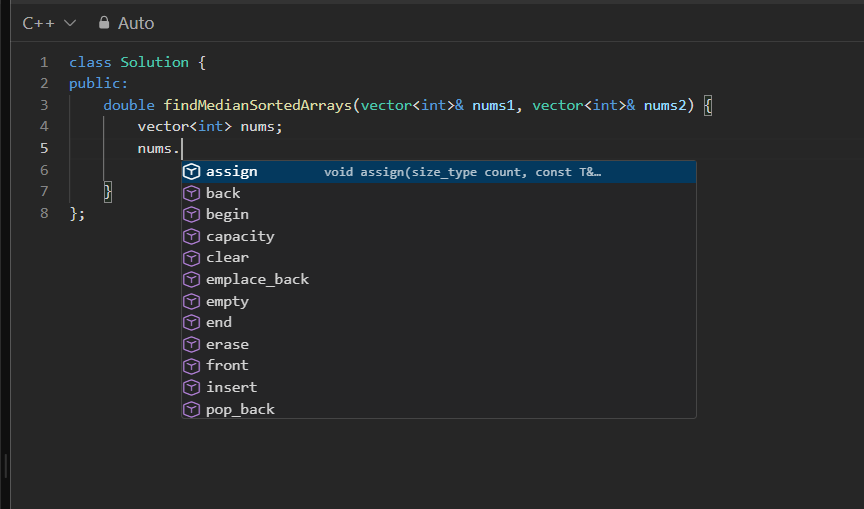

# Leetcode C++ IntelliSense

A lightweight Chrome Extension (Manifest V3) that provides VS Code-style autocomplete and IntelliSense for C++ inside LeetCode's Monaco code editor.

All parsing and completion logic runs entirely locally in your browser with zero latency and no external network dependencies.



---

## Features

### 1. Scope-Aware Variable Autocomplete
- Automatically discovers local variables, loop identifiers, and method parameters.
- Filters out variables outside the current block scope.

### 2. Type-Aware Container Autocomplete
Typing `.` or `->` on a variable displays only the methods relevant to that specific C++ container:
- **vector**: `push_back`, `emplace_back`, `pop_back`, `size`, `empty`, `clear`, `front`, `back`, `begin`, `end`, `insert`, `erase`, `resize`, `reserve`, `assign`
- **string**: `length`, `size`, `substr`, `find`, `rfind`, `push_back`, `pop_back`, `empty`, `clear`, `front`, `back`, `append`, `compare`, `c_str`
- **unordered_map / map**: `insert`, `emplace`, `erase`, `find`, `count`, `contains`, `size`, `empty`, `clear`, `at`, `reserve`
- **set / unordered_set**: `insert`, `emplace`, `erase`, `find`, `count`, `contains`, `size`, `empty`, `clear`, `lower_bound`, `upper_bound`
- **stack / queue / priority_queue**: `push`, `pop`, `top` / `front`, `back`, `size`, `empty`
- **deque**: `push_back`, `push_front`, `pop_back`, `pop_front`, `front`, `back`, `size`, `empty`, `clear`
- **pair**: `first`, `second`
- **ListNode / TreeNode / Node**: `val`, `next`, `left`, `right`, `neighbors`, `random`

### 3. Typo Tolerance & Spelling Matching
- Resolves minor spelling typos on variable names (e.g., `vnums.` resolves to `nums.` and displays vector operations).
- Filters methods dynamically as you type characters after the member access trigger (e.g., `nums.pu` filters to `push_back` and `pop_back`).

### 4. C++ Keywords, Constants & Standard Algorithms
- Primitive types: `int`, `long long`, `double`, `float`, `char`, `bool`, `void`, `auto`, `size_t`
- Constants: `INT_MAX`, `INT_MIN`, `LLONG_MAX`, `LLONG_MIN`, `nullptr`, `true`, `false`
- STL algorithms: `sort`, `reverse`, `max`, `min`, `abs`, `accumulate`, `count`, `swap`, `lower_bound`, `upper_bound`, `binary_search`, `to_string`, `stoi`, `stoll`, `make_pair`, `sqrt`, `pow`, `gcd`, `lcm`

### 5. Competitive Programming Snippets
- `fori` -> `for (int i = 0; i < n; ++i)`
- `fore` -> `for (auto& x : container)`
- `sortv` -> `sort(v.begin(), v.end())`
- `all` / `rall` -> `v.begin(), v.end()` / `v.rbegin(), v.rend()`
- `bfs` / `dfs` / `binsearch` -> Standard algorithmic templates
- `fastio` -> `ios_base::sync_with_stdio(false); cin.tie(NULL);`

---

## Installation

### 1. Build the Extension
Ensure you have Node.js installed, then run:

```bash
npm install
npm run build
```

The compiled extension bundle will be generated in the `dist/` directory.

### 2. Load into Chrome
1. Open Google Chrome and navigate to `chrome://extensions`.
2. Enable **Developer mode** using the toggle in the top-right corner.
3. Click **Load unpacked** in the top-left toolbar.
4. Select the `dist/` folder from this repository.

### 3. Usage
1. Open any problem on [LeetCode](https://leetcode.com/problems/).
2. Select **C++** as the active language in the code editor.
3. Start typing to view suggestions.

---

## Project Structure

```
.
├── manifest.json            # Chrome Manifest V3 configuration
├── package.json             # Build scripts and dependencies
├── tsconfig.json            # TypeScript compiler configuration
├── build.js                 # Esbuild build script
├── src/
│   ├── content/
│   │   └── content.ts       # Extension content script
│   ├── inject/
│   │   └── main.ts          # Main-world script interacting with Monaco Editor
│   ├── engine/
│   │   ├── cppParser.ts     # C++ tokenizer, scope tracker & fuzzy matcher
│   │   ├── stlDefinitions.ts# C++ STL signatures and documentation
│   │   ├── snippets.ts      # Competitive programming snippets
│   │   └── completionProvider.ts # Monaco CompletionItemProvider adapter
│   └── popup/
│       ├── popup.html       # Extension settings UI
│       ├── popup.css        # Clean developer settings styling
│       └── popup.ts         # Settings sync logic
└── dist/                    # Compiled extension ready for Chrome
```

---

## License

MIT
